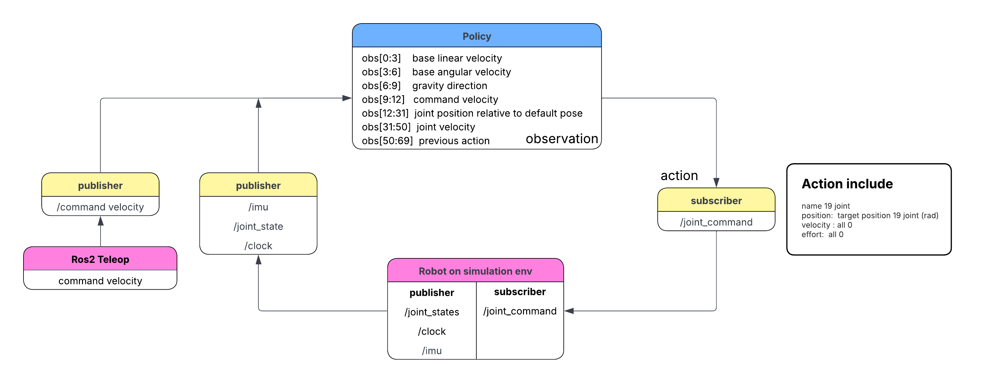

# Humanoid Robot Control Research Summary

Source document: `research-doc.docx`  
Project start date: `2026-05-05`

## Executive Summary

This document describes the research direction and implementation roadmap for a
humanoid robot control project. The main goal is to build a complete control
pipeline for humanoid robots in simulation, starting from Isaac Sim integration,
ROS 2 sensor communication, reinforcement learning policy execution, and later
expanding toward Whole Body Control, training pipelines, and AI model deployment.

The current work focuses on Unitree humanoid robots, especially **Unitree H1**
and **Unitree G1**, using Isaac Sim as the simulation environment. The project is
currently centered on locomotion control, sensor reading, ROS 2 communication,
and policy-based control.

## Project Goals

The long-term objective is to freely and fully control a humanoid robot through
modern control policies and simulation-to-deployment workflows.

The planned development path includes:

1. Simulate humanoid robots in Isaac Sim.
2. Read and publish signals through Action Graph and ROS 2.
3. Work with key robot signals such as IMU, joint states, camera, and depth
   camera.
4. Control the humanoid robot using vendor-provided policies, with an initial
   focus on locomotion.
5. Extend control using Whole Body Control, with a later focus on manipulation.
6. Build full training pipelines for RL and WBC:
   data, feature preparation, model development, training, and evaluation.
7. Deploy trained AI models into the robot system.

## Robot Platforms

The current research and testing are based on two main humanoid robots:

| Robot | Purpose |
| --- | --- |
| Unitree H1 | Main robot for locomotion policy testing |
| Unitree G1 | Additional humanoid platform for simulation and future tests |

The G1 simulation asset referenced in the source document is:

`g1_29dof_with_dex3_rev_1_0`

Repository reference:

`https://github.com/unitreerobotics/unitree_sim_isaaclab.git`

## Isaac Sim, Sensors, and ROS 2

Isaac Sim is used as the main simulation environment. The robot communicates
with ROS 2 through topics and Action Graph nodes.

### IMU Data

The IMU sensor provides a 6-dimensional motion vector:

| Signal | Meaning |
| --- | --- |
| Accel X | Forward and backward acceleration |
| Accel Y | Left and right lateral acceleration |
| Accel Z | Vertical acceleration |
| Gyro X | Roll rotation |
| Gyro Y | Pitch rotation |
| Gyro Z | Yaw rotation |

Isaac Sim can also provide gravity information from the IMU. The document notes
two important frequency levels:

| Component | Frequency |
| --- | --- |
| Low-level sensor/PD reaction | Around 200 Hz |
| Policy command and inference loop | Around 50 Hz |

### ROS 2 IMU Publishing Graph

The IMU publishing pipeline uses the following Action Graph nodes:

| Node | Role |
| --- | --- |
| On Physics Step | Triggers graph execution at each simulation physics step |
| ROS2 Context | Initializes the ROS 2 runtime context |
| ROS2 QoS Profile | Configures Quality of Service for ROS 2 communication |
| Isaac Read IMU Node | Reads IMU data from Isaac Sim |
| Isaac Read Simulation Time | Reads simulation time for timestamp synchronization |
| ROS2 Publish IMU | Publishes IMU data to ROS 2 |

## ROS 2 Control Flow

The document describes a policy-driven ROS 2 control loop where robot state is
published from simulation, transformed into policy observations, and then used to
generate joint commands.

The main ROS 2 topics include:

| Topic | Direction | Purpose |
| --- | --- | --- |
| `/command_velocity` | Input to policy | Desired velocity command from teleoperation |
| `/imu` | Simulation publisher | IMU data |
| `/joint_states` | Simulation publisher | Robot joint state feedback |
| `/clock` | Simulation publisher | Simulation time |
| `/joint_command` | Policy output | Target joint command sent back to robot simulation |

The action output includes 19 joint names and target joint positions in radians.
Velocity and effort are set to zero in the described setup.

## Reinforcement Learning Policy Control

The project uses the Isaac Sim robot policy example for Unitree H1 as a starting
point:

`https://docs.isaacsim.omniverse.nvidia.com/5.1.0/robot_simulation/ext_isaacsim_robot_policy_example.html`

The extension performs the following steps:

1. Load a trained TorchScript policy file (`.pt`).
2. Read the training environment configuration from a YAML file.
3. Compute observations from the robot simulation state.
4. Run inference through the policy.
5. Apply the resulting action to the robot joints in Isaac Sim.

## H1 Locomotion Observation Space

The H1 locomotion policy uses a 69-dimensional observation vector:

| Observation Range | Meaning |
| --- | --- |
| `obs[0:3]` | Base linear velocity |
| `obs[3:6]` | Base angular velocity |
| `obs[6:9]` | Gravity direction |
| `obs[9:12]` | Command velocity |
| `obs[12:31]` | Joint position relative to default pose |
| `obs[31:50]` | Joint velocity |
| `obs[50:69]` | Previous action |

Important implementation notes:

- Linear velocity is obtained from odometry and must be handled carefully with
  respect to world-frame versus local-frame coordinates.
- Angular velocity is read directly from the IMU.
- Gravity is obtained from IMU data and requires conversion before use.

## Locomotion vs Manipulation

The document compares the current H1 locomotion setup with a more complex H1-2
pick-and-place manipulation setup.

| Aspect | H1 Locomotion | H1-2 Pick-and-Place Manipulation |
| --- | --- | --- |
| Observation size | 69 dimensions | Around 90+ dimensions |
| Robot joints | 19 joints | 26 body joints plus 12 gripper joints |
| Sensors | Proprioceptive only | Proprioceptive plus vision |
| Camera | None | Front, left wrist, and right wrist cameras |
| Task focus | Walking and locomotion | Pick and place manipulation |
| Action space | 19 joint positions | Body and arm actions |
| Observation format | Single concatenated vector | Dictionary of observations |
| Environment | Flat terrain | Table with objects |

This comparison shows that manipulation is significantly more complex than
locomotion because it requires richer observation data, camera input, object
interaction, and more joints.

## Current Status

The current work has established the foundation for:

- Running humanoid robots in Isaac Sim.
- Reading IMU-related values.
- Publishing simulation data through ROS 2.
- Understanding the observation structure of the H1 locomotion policy.
- Connecting command velocity, sensor feedback, policy inference, and joint
  command output.

The current technical emphasis is on locomotion control. Manipulation, WBC, and
model training are listed as next stages.

## Future Roadmap

The remaining sections of the source document outline the next major project
directions:

1. Whole Body Control for more complete robot behavior.
2. RL training for specific robot tasks.
3. WBC training and adaptation.
4. Deployment of trained AI models into the simulation and robot system.
5. Expansion from locomotion-only control toward manipulation and full-body
   behavior.