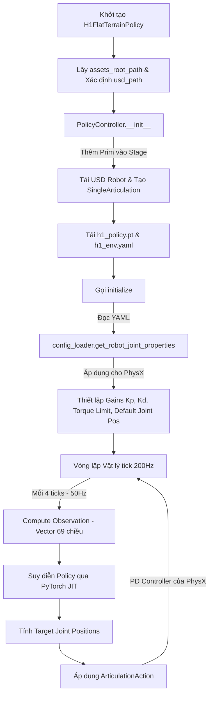

# Phân Tích Cơ Chế Load Model, Hoạt Động & Mô Phỏng Robot H1 Trong Isaac Sim

Tài liệu này cung cấp một phân tích kỹ thuật chuyên sâu về cách Isaac Sim nạp mô hình robot Unitree H1, cấu hình hệ thống vật lý và khớp (joints), đồng thời thực thi chính sách điều khiển di chuyển (locomotion policy) thông qua mạng neural đã được huấn luyện.

Phân tích dựa trên các tệp nguồn sau:
- [h1.py](file:///home/khoa-ng/App/isaac/exts/isaacsim.robot.policy.examples/isaacsim/robot/policy/examples/robots/h1.py) (Đại diện Robot & Vòng lặp chính)
- [policy_controller.py](file:///home/khoa-ng/App/isaac/exts/isaacsim.robot.policy.examples/isaacsim/robot/policy/examples/controllers/policy_controller.py) (Bộ điều khiển chính sách)
- [config_loader.py](file:///home/khoa-ng/App/isaac/exts/isaacsim.robot.policy.examples/isaacsim/robot/policy/examples/controllers/config_loader.py) (Bộ nạp cấu hình YAML)
- Thư mục [policy](file:///home/khoa-ng/App/isaac/exts/isaacsim.robot.policy.examples/policy) chứa mô hình mạng TorchScript [h1_policy.pt](file:///home/khoa-ng/App/isaac/exts/isaacsim.robot.policy.examples/policy/h1_policy.pt) và cấu hình môi trường [h1_env.yaml](file:///home/khoa-ng/App/isaac/exts/isaacsim.robot.policy.examples/policy/h1_env.yaml).

---

## 1. Sơ Đồ Tổng Quan Kiến Trúc (Architecture Overview)

Dưới đây là luồng tương tác giữa các thành phần từ khi khởi chạy đến khi thực thi từng bước mô phỏng:



---

## 2. Chi Tiết Từng Giai Đoạn (Detailed Phase Analysis)

### Giai Đoạn 1: Tải Mô Hình Robot (Model Loading & Prim Creation)

Việc nạp mô hình kết hợp giữa cơ chế tạo đối tượng đồ họa/vật lý (USD Stage) trong Omniverse và việc nạp cấu hình mạng neural:

1. **Xác định USD Path**:
   - Trong [h1.py](file:///home/khoa-ng/App/isaac/exts/isaacsim.robot.policy.examples/isaacsim/robot/policy/examples/robots/h1.py#L50-L53), đường dẫn tệp USD của Unitree H1 được xác định mặc định là:
     `{assets_root_path}/Isaac/Robots/Unitree/H1/h1.usd`.
2. **Khởi tạo Prim đồ họa**:
   - [policy_controller.py](file:///home/khoa-ng/App/isaac/exts/isaacsim.robot.policy.examples/isaacsim/robot/policy/examples/controllers/policy_controller.py#L56-L68) kiểm tra xem Prim vật lý có tồn tại tại đường dẫn Stage chỉ định (`prim_path`) hay chưa.
   - Nếu chưa tồn tại, nó sẽ định nghĩa một Prim mới dạng `Xform` bằng hàm `define_prim()` và thêm tham chiếu (Reference) tới tệp USD thông qua `prim.GetReferences().AddReference(usd_path)`.
   - Sau đó, nó bọc Prim này lại trong lớp `SingleArticulation` của Isaac Sim để quản lý như một thực thể liên kết đa khớp (Articulation).
3. **Tải Neural Network Policy & Environment Config**:
   - Trong [h1.py](file:///home/khoa-ng/App/isaac/exts/isaacsim.robot.policy.examples/isaacsim/robot/policy/examples/robots/h1.py#L54-L57), hàm `load_policy` nạp tệp chính sách `h1_policy.pt` (dưới dạng TorchScript đã được biên dịch thông qua `torch.jit.load()`) và tệp cấu hình môi trường `h1_env.yaml`.
   - Cơ chế nạp YAML trong [config_loader.py](file:///home/khoa-ng/App/isaac/exts/isaacsim.robot.policy.examples/isaacsim/robot/policy/examples/controllers/config_loader.py#L25-L50) sử dụng một `SafeLoaderIgnoreUnknown` tùy chỉnh kế thừa từ `yaml.SafeLoader` để bỏ qua các thẻ Python phức tạp không cần thiết và phân tích cú pháp dữ liệu cấu hình môi trường thành cấu trúc kiểu Python `dict`.

---

### Giai Đoạn 2: Khởi Tạo Thuộc Tính Khớp và Cấu Hình Vật Lý (Physics & Joint Setup)

Sau khi mô hình robot được tải lên Stage, hàm `initialize()` trong [policy_controller.py](file:///home/khoa-ng/App/isaac/exts/isaacsim.robot.policy.examples/isaacsim/robot/policy/examples/controllers/policy_controller.py#L85-L128) sẽ thiết lập các tham số cơ học cho PhysX:

1. **Phân nhóm Khớp & Sắp xếp Thứ tự (Joint Mapping)**:
   - Các thông số khớp được lưu trong mục `actuators` của tệp `h1_env.yaml`, chia thành 3 nhóm:
     - **legs** (hip yaw/roll/pitch, knee, torso): Độ cứng $K_p = [150, 150, 200, 200, 200]$, giảm chấn $K_d = 5.0$, giới hạn mô-men xoắn là $300\,\text{Nm}$.
     - **feet** (ankle): Độ cứng $K_p = 20$, giảm chấn $K_d = 4.0$, giới hạn mô-men xoắn là $100\,\text{Nm}$.
     - **arms** (shoulder pitch/roll/yaw, elbow): Độ cứng $K_p = 40$, giảm chấn $K_d = 10.0$, giới hạn mô-men xoắn là $300\,\text{Nm}$.
   - Hàm `get_robot_joint_properties` trong [config_loader.py](file:///home/khoa-ng/App/isaac/exts/isaacsim.robot.policy.examples/isaacsim/robot/policy/examples/controllers/config_loader.py#L53-L208) chịu trách nhiệm ánh xạ các biểu thức quy tắc (ví dụ: `.*_hip_yaw`, `.*_knee`) sang danh sách khớp thực tế của robot (`self.robot.dof_names`) bằng cách sử dụng `fnmatch.fnmatch`. Điều này đảm bảo các mảng thuộc tính vật lý được sắp xếp hoàn toàn đồng bộ với thứ tự khớp của mô hình USD thực tế.
2. **Thiết lập Gain và Limit lên PhysX**:
   - Sử dụng điều khiển vị trí (`position_control` bằng bộ điều khiển PD tích hợp trong PhysX).
   - Thiết lập độ cứng và giảm chấn: `self.robot._articulation_view.set_gains(stiffness, damping)`.
   - Thiết lập giới hạn mô-men xoắn: `set_max_efforts(max_effort)`.
   - Thiết lập giới hạn vận tốc: `set_max_joint_velocities(max_vel)`.
   - Để các thay đổi này có hiệu lực ngay lập tức trong luồng mô phỏng vật lý PhysX, hàm `get_physx_simulation_interface().flush_changes()` được gọi.
3. **Cấu hình Bộ Giải (Solver Iterations)**:
   - Đọc các thông số từ cấu hình `articulation_props` trong `h1_env.yaml`:
     - `solver_position_iteration_count = 4` (Số lần lặp vị trí).
     - `solver_velocity_iteration_count = 4` (Số lần lặp vận tốc).
     - `enabled_self_collisions = false` (Tắt tự va chạm giữa các bộ phận của robot).
   - Các thông số này giúp tăng độ ổn định động học cho robot dạng humanoid và giảm thiểu tài nguyên tính toán.

---

### Giai Đoạn 3: Vòng Lặp Điều Khiển Mô Phỏng (Simulation Control Loop)

Quá trình chạy mô phỏng vật lý và suy diễn chính sách điều khiển diễn ra liên tục thông qua hàm `forward()` của robot H1:

#### 1. Cơ Chế Chia Tần Số (Decimation Mechanism)
- Mô phỏng vật lý của Isaac Sim chạy với tần số **200Hz** (`dt = 0.005` giây, dòng 19 trong `h1_env.yaml`).
- Tần số suy diễn chính sách (Inference Rate) được định cấu hình bằng tham số `decimation = 4` (dòng 65 trong `h1_env.yaml`).
- Điều này nghĩa là cứ mỗi **4 bước vật lý** thì chính sách mạng neural mới tính toán hành động một lần ($200 / 4 = 50$Hz, chu kỳ $20$ms). Cơ chế này được triển khai tại dòng 136 trong [h1.py](file:///home/khoa-ng/App/isaac/exts/isaacsim.robot.policy.examples/isaacsim/robot/policy/examples/robots/h1.py#L136):
  `if self._policy_counter % self._decimation == 0:`

#### 2. Tính Toán Vectơ Quan Sát (Observation Vector Computation)
Vectơ quan sát 69 chiều được tính toán trong hàm `_compute_observation` (dòng 86-123 trong [h1.py](file:///home/khoa-ng/App/isaac/exts/isaacsim.robot.policy.examples/isaacsim/robot/policy/examples/robots/h1.py#L86)):

| Vị trí Chỉ Số (Index) | Kích thước | Mô tả | Cách tính toán trong mã nguồn |
| :--- | :--- | :--- | :--- |
| **`obs[0:3]`** | 3 | Vận tốc tuyến tính thân robot (Base Linear Velocity) | Xoay từ hệ thế giới sang hệ robot bằng ma trận quay chuyển vị: $v_b = R_{IB}^T \cdot v_I$ |
| **`obs[3:6]`** | 3 | Vận tốc góc thân robot (Base Angular Velocity) | Xoay từ hệ thế giới sang hệ robot: $\omega_b = R_{IB}^T \cdot \omega_I$ |
| **`obs[6:9]`** | 3 | Vectơ trọng lực chiếu (Projected Gravity) | Phép chiếu vectơ trọng lực thế giới $[0, 0, -1]$ vào hệ trục robot: $g_b = R_{IB}^T \cdot [0, 0, -1]^T$ |
| **`obs[9:12]`** | 3 | Lệnh điều khiển chuyển động (Commands) | Vận tốc mục tiêu do người dùng hoặc hệ thống cấp: $[v_x, v_y, \omega_z]$ |
| **`obs[12:31]`** | 19 | Sai lệch góc khớp so với vị trí mặc định (Joint Deviations) | Hiệu số giữa góc khớp hiện thời và tư thế đứng thẳng mặc định: $q_{\text{current}} - q_{\text{default}}$ |
| **`obs[31:50]`** | 19 | Vận tốc khớp hiện tại (Joint Velocities) | Lấy trực tiếp từ cảm biến mô phỏng: `self.robot.get_joint_velocities()` |
| **`obs[50:69]`** | 19 | Hành động ở chu kỳ trước (Previous Action) | Lưu trữ mảng hành động xuất ra ở bước điều khiển trước đó: `self._previous_action` |

**Tổng số chiều**: $3 + 3 + 3 + 3 + 19 + 19 + 19 = 69$ chiều.

#### 3. Suy Diễn Hành Động (Policy Inference)
- Lớp `PolicyController` nhận vectơ quan sát 69 chiều kiểu numpy array và thực hiện suy diễn bằng PyTorch JIT:
  ```python
  with torch.no_grad():
      obs = torch.from_numpy(obs).view(1, -1).float()
      action = self.policy(obs).detach().view(-1).numpy()
  ```
- Kết quả `self.action` là một vectơ 19 chiều biểu thị mục tiêu dịch chuyển khớp tương đối đã được chuẩn hóa trong khoảng $[-1, 1]$.

#### 4. Ghi Dữ Liệu Quan Sát Ngoại Tuyến (Offline Observation Logging)
- Nếu thuộc tính `self._start_reading` được kích hoạt (thông qua giao diện người dùng gọi `start_reading_obs()`), hệ thống sẽ liên tục tích lũy vectơ quan sát ở mỗi chu kỳ 50Hz vào mảng `self._obs_log`.
- Khi thời gian trôi qua vượt quá 10.0 giây, dữ liệu này sẽ được tự động xuất ra tệp JSON:
  `/home/khoa-ng/App/isaac/exts/isaacsim.robot.policy.examples/data/h1_observations.json`
  phục vụ cho việc phân tích độ trễ và đồng bộ hóa với ROS2.

#### 5. Áp Dụng Lực Lên Khớp (Actuation Application)
- Ở mỗi bước vật lý (200Hz), hành động mong muốn sẽ được nhân với hệ số tỉ lệ (`self._action_scale = 0.5`) và cộng với tư thế mặc định ban đầu để có được góc khớp tuyệt đối:
  $$\theta_{\text{target}} = q_{\text{default}} + (a \times 0.5)$$
- Đối tượng `ArticulationAction` được đóng gói với $\theta_{\text{target}}$ và áp dụng trực tiếp lên mô hình bằng hàm:
  `self.robot.apply_action(action)`
- Bộ điều khiển PD tích hợp trong PhysX sẽ tự động sinh mô-men xoắn $\tau$ di chuyển các khớp về vị trí đích dựa trên các hệ số $K_p$, $K_d$ đã thiết lập ban đầu.

---

## 4. Tổng Kết Luồng Thực Thi Mã Nguồn

Để dễ dàng đối chiếu mã nguồn, luồng chạy thực tế được thực hiện tuần tự như sau:

1. **Khởi tạo**:
   - `H1FlatTerrainPolicy.__init__` $\rightarrow$ Xác định USD $\rightarrow$ `PolicyController.__init__` $\rightarrow$ Đăng ký robot lên USD Stage $\rightarrow$ Nạp `h1_policy.pt` và cấu hình `h1_env.yaml`.
2. **Thiết lập**:
   - Hệ thống gọi `initialize()` $\rightarrow$ Phân tích thuộc tính khớp từ YAML thông qua `config_loader` $\rightarrow$ Cập nhật $K_p, K_d$ và giới hạn mô-men xoắn vào PhysX engine.
3. **Mô phỏng**:
   - Ở mỗi timestep: `forward(dt, command)` được gọi $\rightarrow$ Biến đếm tăng $\rightarrow$ Nếu trùng nhịp chia `decimation` (mỗi 4 bước):
     - Thu thập thông tin cảm biến thân thế và khớp $\rightarrow$ Tính toán Observation (69 chiều).
     - Đưa Observation qua mô hình neural TorchScript $\rightarrow$ Nhận Action (19 chiều).
     - Lưu Action hiện tại làm `_previous_action`.
     - Lưu trữ log observation nếu đang trong quá trình ghi dữ liệu 10 giây.
   - Tính toán góc khớp mục tiêu $\theta_{\text{target}} = q_{\text{default}} + a \times 0.5$ $\rightarrow$ Áp dụng lên robot $\rightarrow$ Bộ giải vật lý PhysX tính toán động học và cập nhật mô phỏng stage tiếp theo.
